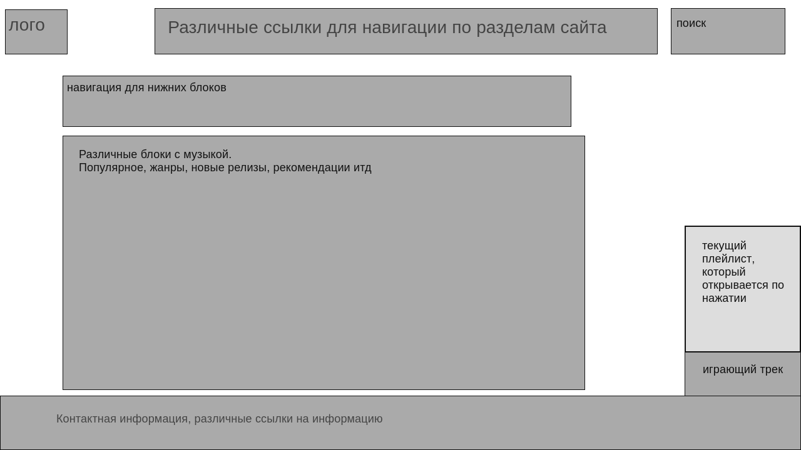
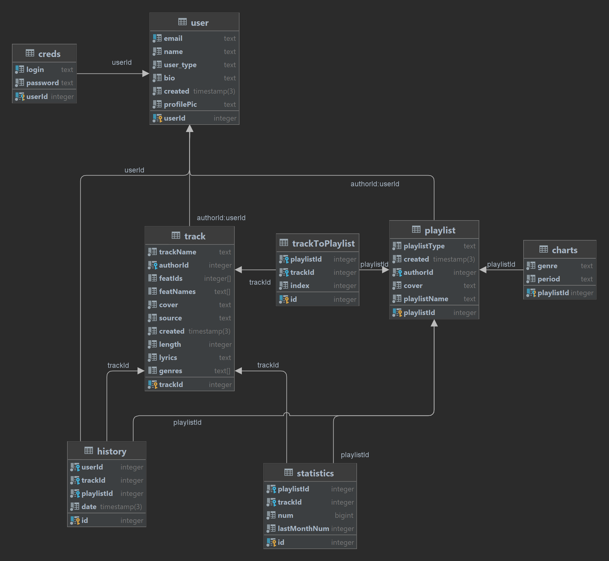

# Web

Власов Роман М33021

# Description

Web project for 3rd course.
[*Layout.*](https://wireframe.cc/pro/pp/506ba241d581629)

# Database

- user - Сущность пользователя с уникальным полем email, типом (музыкант, обычный пользователь)
- creds - Сущность для хранения паролей
- track - Сущность, описывающая сами произведения, хранит их названия, ссылку на автора, ссылки на обложку, трек, текст
- playlist - Сущность, описывающая плейлисты, их названия, тип (альбом, сингл, пользовательский плейлист), ссылку на автора
- trackToPlaylist - Соединяет треки в плейлисты
- charts - Хранит и периодически обновляет ссылки на плейлисты, созданные из самых популярных треков за определенный период и с определенным жанром
- history - Хранит всю историю прослушиваний
- statistics - Хранит для комбинации трека и плейлиста информацию о кол-ве прослушиваний